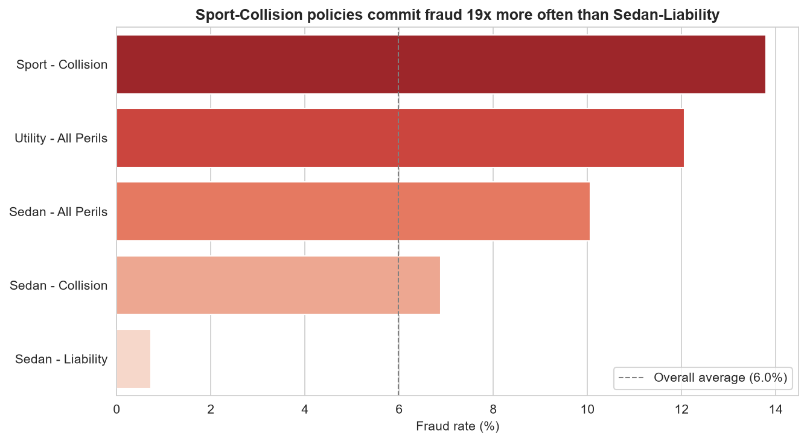
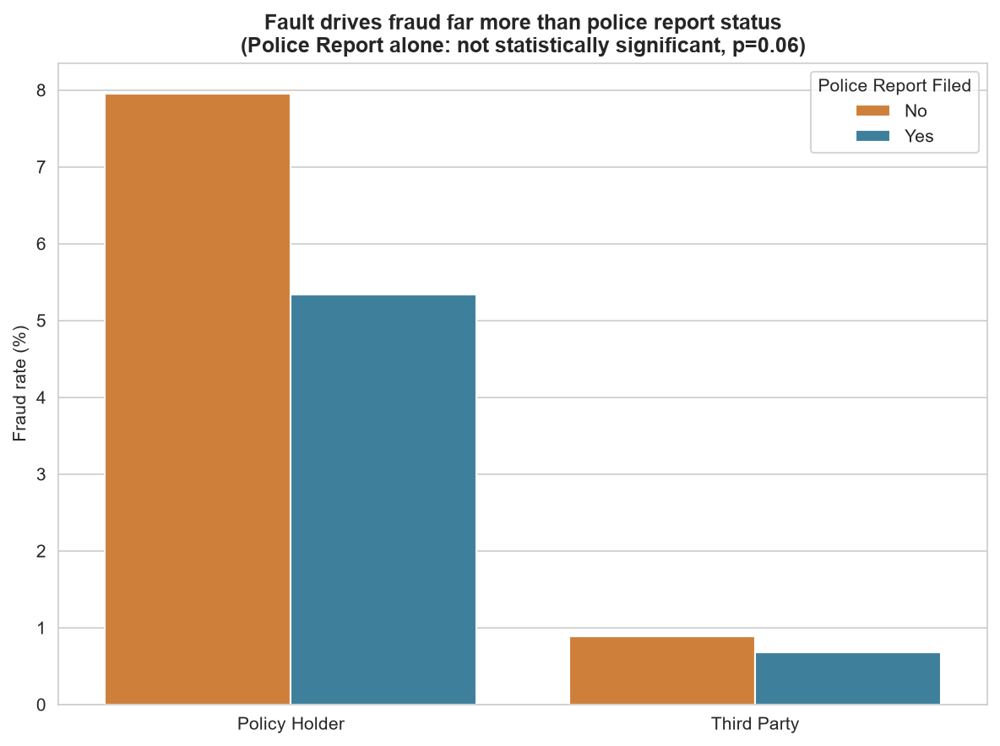
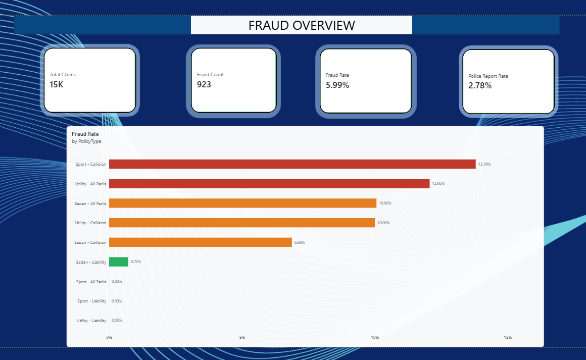

# 🚗 Insurance Claim & Fraud Detection

**End-to-end data analytics project: SQL + Python + Statistics + Machine Learning + Business Strategy**

An insurer's Special Investigations Unit (SIU) has limited capacity to manually investigate
claims. I analyzed 15,419 auto insurance claims to identify which claim characteristics predict
fraud, built a model to rank claims by fraud risk, and recommended how to allocate investigator
time to maximize fraud caught.

---

## Business Problem

Given limited investigator time, which claims should be prioritized for manual fraud review,
and how much fraud would that catch compared to today's approach?

Target: FraudFound_P (0 = no fraud, 1 = fraud). Fraud rate: 5.99% (923 of 15,419 claims) —
imbalanced, so precision, recall, and PR-AUC are prioritized over accuracy throughout.

## Data

Kaggle: Vehicle Insurance Claim Fraud Detection (fraud_oracle.csv) — 15,420 raw claims,
1994-1996, CC0 Public Domain.

Known limitations:
- Data is from 1994-1996 — likely synthetic/older; fraud patterns and claim costs have
  probably shifted substantially since
- Dollar-impact estimates use an illustrative average claim cost, not real payout data
- Findings show association, not proof that a factor causes fraud

## Tools

Python (Pandas, NumPy, SciPy, scikit-learn) - SQL (SQLite) - Matplotlib/Seaborn -
Jupyter - Git/GitHub

## Repo Structure
insurance-fraud-detection/
├── data/raw/ # original CSV
├── data/cleaned/ # cleaned data + SQLite database
├── notebooks/
│ ├── 01_cleaning_features.ipynb
│ ├── 02_sql_analysis.ipynb
│ ├── 03_statistical_tests.ipynb
│ ├── 04_visualization.ipynb
│ ├── 05_machine_learning.ipynb
│ └── 06_recommendation_impact.ipynb
├── sql/01_fraud_analysis.sql
├── images/ # saved charts
├── reports/executive_summary.md
└── README.md

---

## Step 1-2: Data Cleaning

Started with 15,420 rows, already clean (0 missing values, 0 duplicates). Dropped 1 row with
an invalid claim month/day, leaving 15,419 rows. Treated Age = 0 (impossible) as missing and
flagged it separately with Age_Missing. Confirmed PolicyNumber is a pure ID (15,419/15,419
unique) and excluded it from modeling.

## Step 3: Feature Engineering

Built ordinal numeric versions of 8 category columns (AgeOfVehicle, PastNumberOfClaims,
VehiclePrice, etc.), Claim_Delay_Months (time between accident and claim filing), weekend
flags, and yes/no flags for Police_Report, Witness, Policyholder_At_Fault, and Agent_External.
Confirmed Age_Clean and AgeOfPolicyHolder_ord correlate at 0.96 — used only Age_Clean in
modeling to avoid redundant signal.

## Step 4: SQL Analysis

Loaded the cleaned data into SQLite and used window functions (RANK() OVER, PARTITION BY)
to rank fraud rate by vehicle make - see sql/01_fraud_analysis.sql.

| Finding | Result |
|---|---|
| Fraud by policy type | 0.72% (Sedan-Liability) to 13.79% (Sport-Collision) - a 19x spread |
| Fault vs Police Report | Fault dominates (7.96% vs 0.89%); Police Report adds a smaller secondary effect |
| Address change before claim | Recent change correlates with much higher fraud (small-sample caution) |
| Past claims history | Fraud falls as claim history grows (7.79% to 3.38%) - opposite of the hypothesis |
| Fraud by make (window function) | Accura, Saturn, Saab rank highest per claim filed |

## Step 5: Statistical Testing

Every SQL finding was tested formally with effect sizes and a Bonferroni-corrected
significance threshold (alpha = 0.01 across 5 tests):

| Hypothesis | Test | p-value | Effect size | Verdict |
|---|---|---|---|---|
| Policy Type affects fraud | Chi-square | 1.77e-89 | Cramer's V = 0.168 | Confirmed |
| Fault affects fraud | Chi-square | 1.41e-59 | Cramer's V = 0.131 | Confirmed |
| Police Report affects fraud (alone) | Chi-square | 5.95e-02 | Cramer's V = 0.015 | Not significant - confounded with Fault |
| Past claims trend | Spearman | 7.61e-13 | rho = -0.058 | Confirmed (reverses original hypothesis) |
| Address change affects fraud | Fisher's Exact | 1.18e-13 | Odds Ratio = 3.68 | Confirmed |

A key nuance: Police Report looked meaningful in a simple SQL cross-tab, but failed a proper
statistical test on its own (p = 0.06) - its apparent effect was confounded with Fault, a
classic example of why isolated hypothesis tests matter beyond raw group-by percentages.

## Step 6: Data Visualization


Sport-Collision policies commit fraud 19x more often than Sedan-Liability.


Fault status drives fraud far more than police report status - visualizing the confounding
found in Step 5.

(See images/ for all 9 charts: past claims trend, address change, fraud by make, correlation
heatmap, precision-recall curve, confusion matrix, feature importance.)

## Step 7: Machine Learning

Built a Random Forest predicting fraud using only pre-decision claim and policy features,
deliberately excluding PolicyNumber (an ID) and AgeOfPolicyHolder_ord (correlated 0.96 with
Age_Clean, redundant signal). Given the 5.99% fraud rate, accuracy is not a meaningful
metric - a model predicting "no fraud" for every claim scores 94.0% accuracy while catching
zero fraud. PR-AUC (average precision) is the primary metric instead.

| Model | ROC-AUC | PR-AUC |
|---|---|---|
| Dummy baseline | 0.500 | 0.060 (= base fraud rate) |
| Logistic Regression | 0.819 | 0.167 |
| Random Forest | 0.820 | 0.207 |
| Random Forest (5-fold CV) | - | 0.193 +/- 0.013 |

Top predictive features (permutation importance, PR-AUC): PolicyType, BasePolicy, Fault,
VehicleCategory, Policyholder_At_Fault - independently confirming the Step 4/5 findings.

**Threshold note:** the model's default 0.5 cutoff flags ~45% of all claims (95% recall,
13% precision) due to class-weighting during training. This threshold is not used for
deployment - see Step 8 for the capacity-based approach that is actually used.

## Step 8: Recommendation & Estimated Impact

Rather than a single yes/no cutoff, the model is used to rank claims and investigate the
riskiest slice, sized to actual investigator capacity:

| Capacity | Claims Flagged | Fraud Caught | Capture Rate | Precision |
|---|---|---|---|---|
| 5% | 155 | 41 | 22.2% | 26.5% |
| 15% | 463 | 86 | 46.5% | 18.6% |
| 20% | 617 | 104 | 56.2% | 16.9% |
| 30% | 925 | 137 | 74.1% | 14.8% |
| 50% | 1,542 | 181 | 97.8% | 11.7% |

**Recommendation:** investigate the top 15-20% of claims by model score. At 20% capacity,
the model catches 104 of 185 fraud cases (56.2% recall) at 16.9% precision - nearly 3x the
dataset's 6% base rate. Beyond 30% capacity, returns flatten sharply toward the random
baseline, marking a natural stopping point for investigator effort.

**Estimated impact:** at 20% capacity, model-based prioritization catches an estimated 67
more fraud cases than random selection at the same review volume (181% more) - roughly
$536,000 in additional fraud caught using an illustrative $8,000 average claim cost.

Full write-up: reports/executive_summary.md

---

## Interactive Dashboard

Built in Power BI with 4 pages: Fraud Overview, Risk Factor Deep Dive, Capacity & Impact,
and Recommendation — using a red/orange/teal risk-based color system throughout.




*(Full .pbix file: `dashboard/fraud_dashboard.pbix`)*

---

## Limitations

- 1994-1996 data - fraud patterns, claim costs, and policy structures have likely changed
  substantially; retraining on current claims is required before real deployment
- Dollar-impact figures use an illustrative average claim cost, not real payout data
- Association, not causation - flagged claims require human investigation, not automatic denial
- False positives carry real costs (investigator time, customer trust); the 15-20% capacity
  range should be validated against actual SIU team bandwidth

## How to Run

```bash
pip install pandas numpy matplotlib seaborn scipy statsmodels scikit-learn
jupyter notebook
```
Run notebooks in order, 01 through 06.

---

Built by [Tushar Kiloriya] | [https://www.linkedin.com/in/tushar-dhakad-16a5b1328/] | [https://github.com/Tushar-oss-ai/insurance-fraud-detection]
